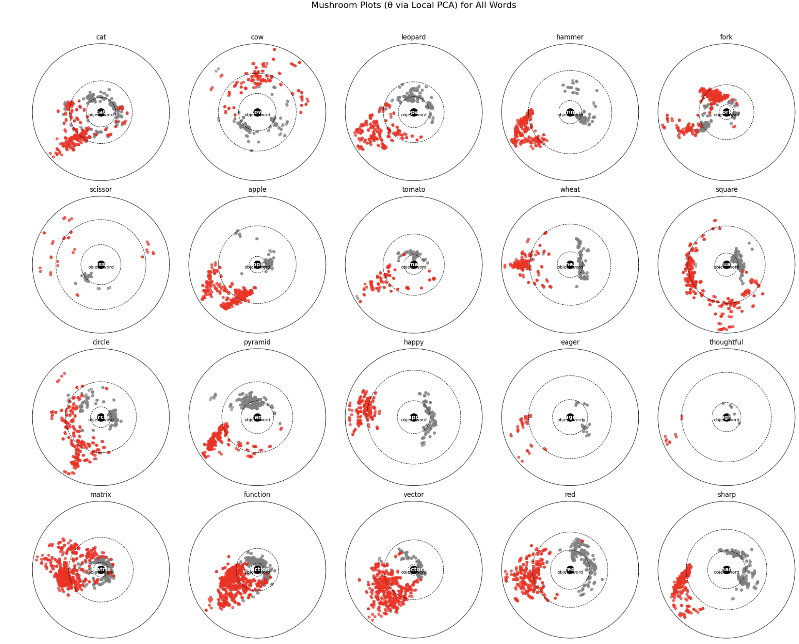
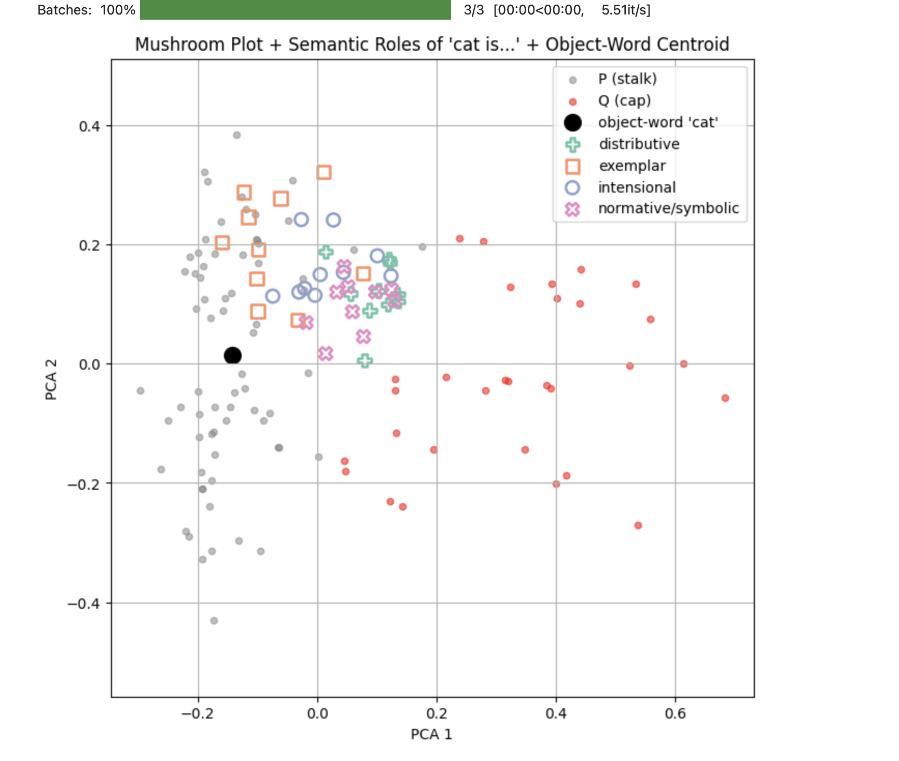
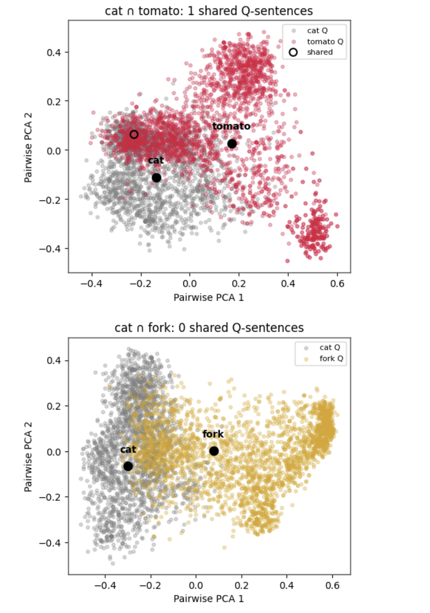

# Abstract

This essay revisits the question of whether patterns in language are real, by comparing two opposing views: Daniel Dennett's "mild-realism" claim that sees patterns are real when they help us compress and predict information, and Norton Nelkin's instrumentalist view that patterns are interpretive constructs, not features of the world itself. To build the argument one could pick up any types of patterns. We chose look at patterns of sentences in a sentence-embedding model, SBERT. Instead of treating meaning as something attached to isolated words, we ask how *object-words* like *cat*, *hammer*, or *water* gain their meaning from how they are *used in* different kinds of sentences. By analyzing thousands of naturally occurring sentences, we show that meaning forms around a word not as a fixed point but as a *shape*---with a dense, literal "core" of usage and a more variable, figurative "halo."[^1] This structure is not imposed from outside but *emerges from the language itself*.

Our method is simple: we classify large sets of naturally occurring sentences into literal (P-type) and idiomatic (Q-type) uses of object-words (e.g., *"cat," "tomato"*), and map them into a 2D semantic space using 5-dimensional role-based projections. The resulting sentence embeddings consistently reveal a distinctive shape: a dense, stable *P-core* surrounded by a looser *Q-cap*.

We argue that **P-cores** satisfy Dennett's criteria for real patterns---they are stable, reproducible, and predictive across samples---while **Q-caps** exhibit the some of the variability and interpretive dependence that motivates Nelkin's skepticism but neverthelss, contrary to his view, these are also "real patterns". Thus, we propose that patterns of sentences can have their own interior structure, determined by the functional role employed by the word. Concepts, in this view, are not a priori givens but *semantical attractors* in the sentence space formed through use.

Philosophicaly there are two important consequences. First, our discovery of a spectrum running from literal, sensory uses to idiomatic uses, give a solution to the ancient puzzles about how words "hook" into reality, and also shows that concepts (like the famous "concept horse") are not atomic objects but fluid patterns. More broadly, any pattern of meaning --- even atitude-propositional or visual --- can be conceived as a dual structure with a stable core that anchors shared objectivity and a fluid halo that shifts with individual experience.

Finally, our model shows that Dennet's mild realism description of patterns is closer to what the actual patterns inside a LLM *really are*. It is difficult to understand the actual rod and cap distributions as a conceptual artifact in the way Nelkin does because they do not depend, as patterns, by the theoretical method we use to look at them.

# Introduction

What makes a pattern real? This question sits at the core of Daniel Dennett's influential 1991 paper *Real Patterns*, which argues that a pattern is real if it enables compression and predictive power --- if it "pays for the cost of its own description." Norton Nelkin (1994) counters that patterns, especially in scientific or linguistic domains, are epistemic conveniences, not ontological commitments: they reflect how we organize the world, not how the world is. This debate remains unresolved and important in contemporary metaphysics: do the structures we find in data reflect an underlying reality, or just our interpretive apparatus?

Our essay uses Dennett and Nelkin's debate about the reality of patterns---whether physical, biological, linguistic or mental---as a starting point for the study of patterns in LLM sentence embeddings.  We use their discussion of various patterns, including belief‑patterns, as a familiar case study, but our focus lies in a different domain: do these emergent clusters in sentences embedding space reflect something real, or are they merely artifacts of our interpretive framework? 

Dennett himself opens *Real Patterns* (Dennett 1991) with visual examples (a bar‑code pattern) to clarify what a pattern is before tackling propositional attitudes.  His claim --- that any pattern "pays for its own description" by enabling compression and prediction---applies universally, not only to minds but to any reliable regularity[^2].  If every pattern carries compressed information --- and if meaning is what multiple observers can extract from a pattern --- then our project is not about patterns in general but about how meaning is instantiated as patterns in the semantic geometry of an LLM.

The reasoning in this essay is founded on the idea (supported by results related to cognitive development in infants[^3]) that words are acquired at first as simple labels for patterns of sensations. "Cat" is, at first, just a label for a shape, a texture, some specific sounds, affects related to it. We call this 'primitive' label-usage of the word, the "object-word"[^4]

Our method targets only one region of language, containing sentences with words such as *cat*, *fork*, *tomato* etc.[^5] For each, we build a corpus of naturally occurring sentences and classify them into **P-type** (literal, concrete use) and **Q-type**[^6] (figurative, idiomatic or technical use), using a role-based classifier we trained. This classification allows us to visualize how meaning unfolds in semantic space --- not as isolated word vectors but as *clusters of use of a word in sentences*. Projected into 2D[^7], the embeddings reveal a consistent topological form: a more dense *stem-like cluster* of literal sentences (the rod), surrounded by a *diffuse cap* of idiomatic uses (the mushroom).

We interpret this rod-and-cap structure as a hybrid answer to the realism vs instrumentalism debate on patterns. The critical insight is that patterns may have structure, like *internal patterns*; more often than not patterns are not atomic entities and because of this generalizing about their meaning, behavior etc. might be risky. The *rod*, composed of literal and perceptual uses, meets Dennett's criteria: it is dense, generalizable, and predictive.[^8] The *cap*, more diffuse and variable, reflects a pattern of extensions, metaphors, and abstract uses. While this aligns with Nelkin's more instrumentalist view because its structure depends heavily on context (text corpus, language user etc.), we argue that the cap is not an epiphenomenon. It is the *word-concept itself*[^9]---not a prior schema that guides recognition, but a structure that *emerges* from linguistic use.

Our model shows that the pattern of the cap (i.e. the meaning of the word) is a pattern of sentences, that is, a pattern of word use; one acquired by use, and not by definition. This approach also solves some problems pertaining to meaning in general: how can meanings evolve and still be coherent? How can we have slightly different meanings for words and still be able to communicate? It also sheds some new light on Quine's indeterminacy of translation: "gavagai" is not to be translated by observing actions and stances but by looking at the pattern of sentences the word is used in.

Theoretically, this model also draws on Wittgenstein's "meaning is use" and Quine's semantic holism, while showing how phenomenological demands for grounding---especially from Husserl and Merleau-Ponty---remain unresolved in current LLMs. Lacking sensory input, LLMs produce patterns that are meaningful within the system but unanchored in perception. Still, their internal geometry lets us ask the philosophical question anew: what makes a pattern *really* real?

It is important to note that Dennett and Nelkin each treat a wide array of patterns---visual, biological, linguistic, and mental---using propositional attitudes (beliefs, desires, intentions) as a prominent example.  Their focus on belief‑patterns illustrates how any higher‑order regularity can serve explanatory work, but does not limit their account to minds alone.  By contrast, our rod‑and‑cap model examines *patterns in language*---clusters of sentences containing a given word, mapped into a high‑dimensional semantic‑role space via LLM embeddings.  These linguistic patterns do not presuppose a theory of mind or belief attribution; they track *how words surface and cohere* in use---literal versus metaphorical, agentive versus perceptual, etc.  While we draw on Dennett's and Nelkin's insights about realism and emergence, we do not aim to offer a new theory of propositional attitudes.  Instead, we show that *concepts in language emerge topologically from observable usage‑patterns*, and that witnessing this dual structure can illuminate the broader Realist/Instrumentalist debate they inaugurated.

I moved all technical references to footnotes, to focus on the philosophy wile giving a chance to the interested reader to evaluate the method. All programming is accessible through a Jupyter notebook that can be [accessed here](https://jupyter.antimaterie.ro/user/jhubuser/notebooks/HomepageTopologicalSemantics.ipynb) using user:jhubuser and password:uvc3xfy. As I am not a programmer, nor a LLM technical expert, I used ChatGPT extensively to write the code included in the notebooks.

# Sentence Embeddings and Structuralist Semantics

Some preliminary considerations, which touch to our model and the fundamental ideas from the structuralist view of meaning, may be needed to avoid possible confusions later on in the text.

First, our model is built in the *sentences embedding space* not in the word embedding space. It follows that each point in our plots is a sentence containing the word it is plotted for, not some other words. Simply said, for *cat*, we plot the projection in a 2D plane of the vectors of all the sentences with *cat* in our experimental sets. What we show is that the pattern of the sum of projections, **has a structure**: sentences where *cat* is used literally (P) are clustered. We use this cluster to calculate a *semantic attractor*[^10] which we posit represents the "object-word" and we figure it by a big black dot in many of our plots. But keep in mind this is not a word, we are in a sentence space.

Second, the structuralist view had an importat role in understanding LLMs:

> \_"Another important theoretical stepping stone on the road to modern language models is the so-called distributional hypothesis, first proposed by the linguist Zellig Harris in the 1950s (Harris 1954). This idea was grounded in the structuralist view of language, which posits that linguistic units acquire meaning through their patterns of co-occurrence with other units in the system.Harris specifically suggested that the meaning of a word could be inferred by examining its distributional properties, or the contexts in which it occurs. Firth (1957) aptly summarized this hypothesis with the slogan "You shall know a word by the company it keeps," acknowledging the influence of Wittgenstein (1953)'s conception of meaning-as-use to highlight the importance of context in understanding linguistic meaning.\_ (Millière and Buckner 2024)"

This view still prevails today in the idea that the meaning of one word is determined by the cloud of "neighbors" in the highly-dimensional LLM embedding space; the training representation as a process of "word vectors alignment" makes this interpretation of a word meaning quite popular. However, it is my view that if it is to properly investigate Witgenstein "meaning as use", we need to look at the *sentence embedding space*, not at the *word embedding space*, simply because we use words only in sentences. In other words, meaning does not emerge from words association inside the LLM, but also from patterns of the sentences a given word is used in.[^11]

# From Words to Space: Semantic Embeddings and Role Axes

Picture a vast conceptual field where every sentence is assigned a coordinate, i.e. a point.  If we focus on sentences that share a given word, all these points create some sort of shape rather than falling at random.  In the 768D space of SBERT they curve and fold like a thin surface (technically a manifold in a lower dimension, say 5D) floating inside a 3D space---much as a circle sits inside three-dimensional space. There is a lot of research done on these lower dimension manifolds that can be found inside the embedding space. Some of them found that even if the 768 dimensions are needed for proper embedding, only between 5-20 of them really count when the model is used. Our question then, is: in what subspace these shapes created by all sentences with *cat* live and what do these subspaces axes mean to us?

## Semantic Roles as Axes

We took an empiric approach and picked five cardinal directions that track familiar philosophical contrasts; we call them "semantic axes". Initial research suggested that there are several semantic axes around which patterns of sentences display a verifiable gradient:

- **Agent ↔ Object** Who acts or is acted on
- **Literal ↔ Metaphoric** Whether words point directly or obliquely
- **Perceived ↔ Symbolic** Whether reference is sensory or conceptual
- **Quantity ↔ Quality** Whether talk is about how much or of what kind
- **Thing ↔ Concept** Whether the word names a substance or a signification

Except "Thing ↔ Concept", it became clear later on that they can be quite arbitrary[^12]. Every sentence can thus be located by a five-number "role vector," revealing its blend of agency, literality, and so on.[^13]  As more sentences are classified and evaluated against this specific 5D space, it soon became clear that one composite axis---angled away from *Perceived vs. Symbolic* and leaning toward both *Thing vs. Sign* and *Literal vs. Metaphoric*---turns out to be the main corridor along which meaning slides from concrete usage into idiom; we called that "real axis" because it captures a familiar philosophical journey: from showing to saying, from concrete to concept.

## The Method: Proust vs Quine in Role Space

To test the idea, we constructed two contrasting sets of sentences, where a given word appears in each of them:

- **Proust Set**: sensory, phenomenal uses (e.g. "the candle flickered")
- **Quine Set**: abstract, symbolic uses (e.g. "the candle represents hope")

We tested these sentences against the semantic axes: each sentence projected into 5D role space using the semantic axes. The separation proved to be clear and measurable.[^14]  For philosophers this may be a deep claim: phenomenological and analytic sentences occupy genuinely different regions of the sentences space, not just different moods of the same discourse.

# Empirical Patterns in the Data

In the topology of linguistic space, literal utterances gravitate toward their lexical centre, gathering in taut, pillar-like formations that attest to a word's stable core of use. By contrast, figurative utterances disperse outward in loose, mutable halos whose boundaries blur into those of neighbouring words, testifying to meaning's dependence on shifting context. Visualised in the so-called *mushroom plots*, rod sentences appear as tight, grey clusters centred on the word embedding, while cap sentences form asymmetrical red fans.  Quantitatively, literal clusters show low variance and high pairwise cosine similarity, whereas figurative clusters occupy a far larger semantic volume.

These patterns -- *compact, repeatable clusters for rods vs. sprawling, context-dependent clouds for caps* -- are observed consistently across multiple embedding models and pretraining runs.

# Our Model: Rods and Caps

Across many examples, literal sentences huddle tightly around a word's centre, like a slender rod.  Figurative sentences spread outward in wide, overlapping caps.  The tight rods point to a repeatable essence; the sprawling caps to a dependency on context.  The pattern is robust: whatever model we use, rods stay compact, caps diffuse.[^15]  It offers a linguistic mirror of Aristotle's substance/accident divide: the rod marks the substance, the cap the shifting accidents.

- **Rods (P‑sentences)**:  Embeddings of literal usages cluster tightly near the word's core meaning. In every visualization, P‑sentences form a small, centered "rod" around the word embedding (black dot), with little sprawl. High pairwise cosine similarities among P-sentences and low PCA spread indicate that these literal instances are highly compressible and repeatable across contexts.

- **Caps (Q‑sentences)**: Embeddings of figurative usages scatter outward in many directions, forming broad "caps." For a given word, Q-sentences often occupy a multi-lobed shape (e.g. \[11\] shows distinct clouds for "vector Q," "square Q," etc.). These caps overlap arbitrarily with those of other words and rarely share exact sentences (e.g. the cat--fork cap plot shows zero overlap). In short, caps are **diffuse, polymorphic, and less systematically compressible** than rods.

These project findings support a clear empirical dichotomy: *rod* patterns are tight and stable, *cap* patterns are wide-ranging and variable.

## Rods and Dennett's Real Patterns

Dennett (1991) defines **real patterns** by their **compressibility, predictive power, and generality**.  The rod-clusters satisfy each of these criteria. First, they are highly compressible: instead of storing each literal sentence, one can describe a whole cluster succinctly (e.g. "all sentences using *cat* in the literal sense").  Dennett formalizes this via Kolmogorov complexity -- a sequence has a pattern iff it admits an efficient description .  The rod clusters clearly allow such compression (one rule covers all cluster points) as opposed to caps which require many bits to list.  Second, rods have predictive utility.  In folk-psychological terms, knowing a rod-pattern (a word's literal usage) lets us predict usage in new contexts.  Dennett notes that folk-psychology's "enormous predictive leverage" comes from such reliable patterns.  Analogously, the embedding-space rod for *"cat"* helps predict where new literal-sense *cat*-sentences will lie (they all map near that cluster). Finally, rods generalize: the same compact structure reappears across different corpora, models, or contexts.  Recent work on model embeddings finds that **semantic categories form low-dimensional manifolds** that align across models . For example, Park et al. (2024) show that **hierarchical/conceptual relations** are encoded as geometric structure in token embeddings -- precisely the kind of stable, generalizable pattern rods exemplify.

In summary, rod-patterns behave like Dennettian real patterns: they compress data (one "rod" covers many examples), they enhance prediction (future literal uses fall into the same cluster), and they recur across settings.  These findings strongly support treating rods as **real patterns with epistemic and (mild) ontic status** .

Our empirical mapping of sentence-level embeddings reveals a structured distribution in which different functional uses of the word *cat*---literal, intensional, distributive, symbolic---form a coherent topological subspace between two poles: the phenomenal base (P) and the conceptual abstraction (Q). By computing the centroid of the P set---the most perceptually grounded uses---we obtain an empirical anchor point for what we call the *object-word*: a statistical center of the word's appearance across literal contexts. Interestingly, this centroid lies beneath and slightly offset from the cluster of definitional sentences like "A cat is a mammal," suggesting that intensional definitions are not the semantic core of the word, but rather a compressed projection that stabilizes certain generalizations. (See Fig.2, below) This aligns with Dennett's view, especially in his discussion of Churchland and Fodor (Fodor 1987), that the apparent precision of linguistic definition masks a much higher-dimensional pattern of cognitive regularity. Just as Churchland (Churchland 2000) describes declarative utterances as one-dimensional projections of a multi-dimensional kinematic state, our analysis shows that definitions emerge as linear stabilizations within a broader semantic manifold. The object-word, in this view, is not a fixed token or entry, but a center of gravity within a distributed field of appearances---a real pattern in Dennett's sense, empirically discoverable through topological regularities in language use.

Dennett repeatedly warns against reifying categories like "belief" or "definition" as discrete states. Instead, he proposes that what we treat as a stable cognitive or linguistic category is often:

- A **real pattern** across a cloud of behaviors (or sentences),
- Detectable because of its **predictive compressibility**.

> "A pattern exists in some data---*is real*---if there is a description of the data that is more efficient than the bit map, whether or not anyone can concoct it. That's what it is for a pattern to be real. \[...\] It has explanatory power; it makes predictions; it shows up across multiple levels of description." (*Real Patterns*, Dennett 1991)
>
> "Folk psychology works, not because beliefs and desires are 'real' in some special metaphysical sense, but because there are real patterns in behavior that are captured---usefully, predictively---by the intentional stance." (ibid.)

Our model seems to show exactly that:

> The intensional subset (definitions subset) is not a class, but a **coherent submanifold**---a repeatable, structurally discoverable **cluster of semantic trajectories**.

This vindicates Dennett's middle path between Fodorian modular essentialism and Churchland's vectorial reconceptualization.

It is important to note that, just like the dots in the "elephant patterns" used to illustrate Dennett's points, where dots were 'beliefs', our dots here are sentences, i.e. devices of usage for a given word. The patterns we see emerging are 'use-patterns' and not any sort of statistical averages:

> *"The patterns discerned are not statistical averages (e.g., 'Democrats tend to favor welfare programs') but personal cognitive idiosyncrasies (e.g., 'She thinks she should get her queen out early')." (ibid.)*

What we calculated above as 'object-word "cat"' is more of a "semantic attractor"[^16] for sentences where 'cat' is used in its literal menaing, and not an 'average'.

There is another interesting result here: the "cat" P-sentences semantic attractor is not centered within the definition-sentences for 'cat', showing that, in fact, the 'true meaning' of cat (the sum of all literal P-sentences with 'cat') is different from what we take as 'dictionary definitions'.

## Caps and Nelkin's Anti-Realism

Nelkin's argument is This apparent alignment with Nelkin, however, breaks down when we consider his central claim about *conceptual priority*. Nelkin argues that we cannot even *recognize* a belief-pattern until we already *possess* the relevant propositional-attitude concepts---making the concept epistemically prior to the pattern. But in our rod/cap framework, this chicken-and-egg structure is avoided entirely. The *rod* is assembled empirically, as a body of appearances---sentences in which a word like *cat* is used across diverse roles and contexts. The *cap*, or conceptual cluster, then emerges from the ¨conceptual¨use of the word *cat* in differend Q sentences. It is not that we see the pattern *because* we have the concept; rather, we *form* the concept *because* we encounter and respond to the pattern. In this view, caps are not imposed by prior concepts but are *stabilizations of functional use*---resolvable from the rod without assuming prior interpretive categories. The concept is not a precondition for pattern-recognition, but a *post hoc crystallization* of patterns already implicit in language.

This emergence is visible in the comparative cap plots above. In the upper graph, the Q-sentence clouds for *cat* and *tomato* partially overlap and share a single sentence (circled), indicating a thin zone of functional convergence---likely metaphorical or figurative. In the lower graph, *cat* and *fork* exhibit no shared Q-sentences and form disjoint semantic manifolds, despite both being concrete nouns. The *cap* for each word---marked by the black dot---represents the center of its pattern of usage, not a prior conceptual scaffold. The fact that these caps **do not require predefined categories** to separate them, and yet fall into stable, functionally distinct clusters, illustrates precisely the point: concepts *emerge from patterned use*, not from conceptual imposition.

## Insights from Recent Research

Recent AI and cognitive-science work resonates with these interpretations. For example, Lee et al. (2024) find that semantic content in LLMs occupies **high-dimensional, nonlinear** subspaces, whereas formal (syntactic or literal) structure is more "linear" .  In their "Geometric Signatures" study, the authors show that **semantic complexity correlates with nonlinear geometry**, suggesting that figurative or abstract meaning (as in caps) lives in complex, dispersed regions. This supports the idea that caps -- rich in semantic nuance -- are geometrically diffuse. Conversely, researchers have observed that **literal category information tends to reside in low-dimensional manifolds**. Park et al. (2024) demonstrate that token embeddings encode categorical and hierarchical relationships in tidy geometric form .  Such findings imply rods (tied to concrete categories) naturally form tight clusters, whereas caps (tied to open-ended meanings) remain scattered.

Another line of work ("semantic wave functions" (Laine 2025) ) treats word embeddings analogously to quantum states, highlighting that meaning involves both magnitude and phase.  While more speculative, this view underscores that **meaning is inherently contextual and dynamic** in embedding space -- a picture in line with Nelkin's anti-realism for caps. No recent work directly asserts "Dennett vs. Nelkin," but overall the AI literature agrees: embeddings neatly capture literal/concrete patterns, whereas figurative and abstract meanings require richer, more entangled representations.

# A First Conclusion: Reliability of the Hybrid Claim

In sum, the project data largely vindicate the hybrid claim.  **Rods** satisfy Dennett's realism: they are compressible, predictive, and systematic (i.e. real patterns) . **Caps** display Nelkin-style anti-realism: they depend on our interpretive framework and have fuzzy, labile boundaries (the data show they "overlap everything and define nothing" in themselves).  Thus the distinction "rod = real pattern, cap = anti-real pattern" is **broadly defensible** given the evidence.

That said, some nuance is needed. Not all literal clusters are perfectly ideal (occasional P‑sentence outliers occur), and certain recurring metaphors might form moderately tight sub-clusters (blurring the rod/cap line).  Moreover, equating metaphysical "reality" with these distributional facts risks overreach: Dennettian realism is a pragmatically minded ontology, and Nelkin's stance is one perspective on pattern discovery.  However, **philosophically the hybrid view holds up** as a working interpretation. The rods behave as stable patterns on which one can base abstraction, while the caps behave like contextually imposed patterns. In practice, the project's cap-and-rod framework provides a useful and largely coherent mapping onto Dennett's and Nelkin's criteria -- with the caveat that meaning in neural embeddings is subtle and sometimes resists strict categorization (as recent research shows).

There is also an interesting question to be asked about Nelkin instrumentalist view. He says: *"If there are 'visible' patterns of bodily movements that constitute believing that Clinton is President, I, for one, am totally ignorant of what they are. It is true that I ascribe this belief (and others) to people on the basis of what they say and do; but if it is on account of seeing a pattern, I am unaware of what that pattern is, or that I see it, or even what sort of pattern it could possibly be."* (Nelkin 1994, 63) But one can ask, if I take all of Nelkin's sentences he can form with "Clinton" and "president" in them, and map them in our model, will some sort of \_real_pattern, observable pattern, emerge? It loks like a flaw in Nelkin's argument when he reduces beliefs to bodily patterns.

# A second conclusion about patterns as projections

Nelkin's point, even if it seems flawed because of its reduction to bodily movements, carries some intuitive truth about patterns that we can see in the way our rod and cap mushroom model works.

> We realize, from an introspective understanding of our own internal states, that we impose these patterns on our bodily movements because we have beliefs, desires, or the like. The patterns are not already out there, awaiting discovery. We create those patterns because we are the kinds of beings we are, because we have the kinds of internal states we have, because we are capable of acting on the world. (Nelkin 1994, 69)

What seems to be at work allways in pattern recognition is some sort of projection: we do project onto the objects of the world the content of our minds when we recognize them. Nelkin seems to say that in order to project something you need to have it first, and because he implicitly considers concepts to be some sort of "objects" we're given, he claims there is a faulty recursion in this, like in his 'cat' example. But in our model the 'cap', which is in its totality the meaning of the word, constantly grows since our infancy when we acquired language, being constantly projected *and adjusted* as a result of the feedback from projection. If I only knew black cats all my life, "this is a white cat" it is not a sentence in my 'cat cap'. But once I see a white cat, the cap increases to accomodate the reality check.

# A Philosophical Conclusion

One important consequence derives from the finding of a literal, concrete use vs idiomatic, metaphorical or symbolic use axis that structure any semantic pattern. Beyond the technical jargon it is very probable that this axis relates to the very old philosophical problem of how a word "hooks" to the real world but also to the equally old problem of what "concepts" really are. Our model links the pre-verbal patterns of sensations with patterns of words usage in sentences, proposing a new definition for concepts.

In philosophical terms there is nothing preventing a generalization of our findings in semantic patterns. We think of patterns, usually, as some sort of atomic entities that lack internal structure. But a dual structure, with a hard core - a more rigid part of the pattern, and a flexible halo acquired in time and in continuous change, or even dependent on the individual experiences, can be in principle theorized for all sort of patterns, including propositional states patterns or even visual patterns. This may be possible because all our knowledge implies a connection from the outside world to our mind and it lives allways under the tension of "hard, objective truth" and "personal, subjective interpretation"

# What's next

There are a number of issues with the above argument that we chose to leave for the end, for the sake of the fluidity of the essay. Any future work needs to address them:

### Known architectural biases

Throughout we treat clustering structure in SBERT embeddings as candidate *real patterns*. But any detecting device carries its own inductive biases, so we need to ask: *are the literal/figurative clusters properties of English usage, or artefacts of SBERT's transformer architecture?* There are some known architecture biases we need to consider:

  -----------------------------------------------------------------------------------------------------------------------------------------------------------------------------------------------------------------------------------------------------------------------------------------------------------------------
  Architectural tendency                                                                        Empirical evidence                                                                                                   Possible impact on our task
  --------------------------------------------------------------------------------------------- -------------------------------------------------------------------------------------------------------------------- ----------------------------------------------------------------------------------------------------
  **Permutation-symmetry bias** -- self-attention favours token-order--invariant correlations   Lavie et al. 2024 derive this analytically in the infinite-width limit                                               Could group idioms with similar content words even when syntax differs

  **Similarity decisions dominated by high-order feature interactions**                         Vasileiou & Eberle 2024 use BiLRP to show SBERT similarity is driven by a few high-relevance token pairs             May exaggerate metaphor clusters if certain lexical triggers recur

  **Documented drop on figurative tasks**                                                       Wen & Rezapour 2025 (preprint) report that vanilla SBERT underperforms on sarcasm until a prototype layer is added   Suggests literal/figurative separation could partly reflect model weakness, not linguistic essence
  -----------------------------------------------------------------------------------------------------------------------------------------------------------------------------------------------------------------------------------------------------------------------------------------------------------------------

### Understanding or mimicking?

A common rejoinder is that LLMs do not *understand* meaning but merely reproduce statistical form. Dennett's "real pattern" criterion is epistemic and predictive, not ontological. If a statistical pattern lets us compress and predict use, it counts as real for us, even if the underlying mechanism is brute-force memorisation. The question if a LLM understands the pattern when using it is beside the point. It would be the same to ask if a cat understands the "mose" pattern when seeing one. But this being said, a more reliable "human-used" set of sentences may be needed to show that P-rods and Q-caps are feature patterns of the real natural language and not some LLM artifact.

### Prove Q-caps have subjective content but objective shape

Related to the problem above, but somewhat different, is the supposition made in the text that Q-caps (the "meaning caps") have similar shapes but different sentence content from person to person. An experiment can be made, asking a number of people to write 30 cat sentences on a piece of paper, as they come to mind. Then introduce them in our model and compare the resulting caps.

::: pagebreak
:::

# Bibliography:

For some geometry / embedding ideas: (Park et al. 2025), (Lee et al. 2025) , both preprints

::::::::::::: {#refs .references .csl-bib-body .hanging-indent entry-spacing="0"}
::: {#ref-churchlandNeurocomputationalPerspectiveNature2000 .csl-entry}
Churchland, Paul M. 2000. *A Neurocomputational Perspective: The Nature of Mind and the Structure of Science*. 4.print ed. A Bradford Book. Cambridge, Mass.: MIT Press.
:::

::: {#ref-dennettRealPatterns1991 .csl-entry}
Dennett, Daniel C. 1991. "Real Patterns." *The Journal of Philosophy* 88 (1): 27. doi:[10.2307/2027085](https://doi.org/10.2307/2027085).
:::

::: {#ref-fodorPsychosemanticsProblemMeaning1987 .csl-entry}
Fodor, Jerry A. 1987. *Psychosemantics: The Problem of Meaning in the Philosophy of Mind*. Explorations in Cognitive Science 2. Cambridge, Mass: MIT Press.
:::

::: {#ref-laineSemanticWaveFunctions .csl-entry}
Laine, Timo Aukusti. 2025. "Semantic Wave Functions: Exploring Meaning in Large Language Models Through Quantum Formalism." *Open Access Journal of Applied Science and Technology*. Accessed May 4. doi:[10.33140/OAJAST](https://doi.org/10.33140/OAJAST).
:::

::: {#ref-leeGeometricSignaturesCompositionality2025 .csl-entry}
Lee, Jin Hwa, Thomas Jiralerspong, Lei Yu, Yoshua Bengio, and Emily Cheng. 2025. "Geometric Signatures of Compositionality Across a Language Model's Lifetime." arXiv. doi:[10.48550/arXiv.2410.01444](https://doi.org/10.48550/arXiv.2410.01444).
:::

::: {#ref-millierePhilosophicalIntroductionLanguage2024 .csl-entry}
Millière, Raphaël, and Cameron Buckner. 2024. "A Philosophical Introduction to Language Models --- Part i: Continuity with Classic Debates." arXiv. <https://arxiv.org/abs/2401.03910>.
:::

::: {#ref-nelkinPatterns1994 .csl-entry}
Nelkin, Norton. 1994. "Patterns." *Mind & Language* 9 (1): 56--87. doi:[10.1111/j.1468-0017.1994.tb00216.x](https://doi.org/10.1111/j.1468-0017.1994.tb00216.x).
:::

::: {#ref-parkGeometryCategoricalHierarchical2025 .csl-entry}
Park, Kiho, Yo Joong Choe, Yibo Jiang, and Victor Veitch. 2025. "The Geometry of Categorical and Hierarchical Concepts in Large Language Models." arXiv. doi:[10.48550/arXiv.2406.01506](https://doi.org/10.48550/arXiv.2406.01506).
:::

::: {#ref-prudenBirthWordsTenMonthOlds2006 .csl-entry}
Pruden, Shannon M., Kathy Hirsh-Pasek, Roberta Michnick Golinkoff, and Elizabeth A. Hennon. 2006. "The Birth of Words: Ten-Month-Olds Learn Words Through Perceptual Salience." *Child Development* 77 (2): 266--80. doi:[10.1111/j.1467-8624.2006.00869.x](https://doi.org/10.1111/j.1467-8624.2006.00869.x).
:::

::: {#ref-seidlTouchLearnMultisensory2024 .csl-entry}
Seidl, Amanda H., Michelle Indarjit, and Arielle Borovsky. 2024. "Touch to Learn: Multisensory Input Supports Word Learning and Processing." *Developmental Science* 27 (1): e13419. doi:[10.1111/desc.13419](https://doi.org/10.1111/desc.13419).
:::
:::::::::::::

[^1]: We chose to move technical details to footnotes to allow for philosophical focus. Technically, we use sentence embeddings from a transformer language model to represent each sentence as a point in a high-dimensional space. We then project these points onto conceptual axes (e.g., literal/metaphoric) constructed from contrastive examples, reducing the data to a 5-dimensional semantic role space. Within this space, we observe consistent geometric patterns: literal uses of a word tend to cluster densely, while figurative uses spread out more diffusely. This allows us to model meaning not as a static label, but as a distributional topology grounded in actual use.

[^2]: It is true that 'the elephantine pattern' of Ella's propositional attitudes employed by Dennett makes a point but also risks confusing the reader: it is not the visual pattern that matters, just the fact that two different sets of points, that do not totally overlap, make the same pattern.

[^3]: Among others: Hollich GJ, Hirsh-Pasek K, Golinkoff RM, et al. Breaking the language barrier: an emergentist coalition model for the origins of word learning. *Monogr Soc Res Child Dev*. 2000;65(3):i-123, (Seidl, Indarjit, and Borovsky 2024), (Pruden et al. 2006)

[^4]: It is clear that a LLM like BERT acquires language not from embodied experience but by training on large corpuses of text. But, however different, the LLM builds its internal patterns on sentences we *really* use, utter, write etc. The "object-word" we introduced first in the abstract is far more than a theoretical device, but its relation to how language develops is beyond the scope of this essay. For our purposes, it is to be taken simply as the *phenomenological* side of any word.

[^5]: Of course, language is much more complicated, including concepts with no real-world existence, like mathematical concepts (like *matrix*, *vector*, *function* we'll discuss briefly later on), verbs, indexicals, prepositions and so on. But for the purposes of this essay, which are to investigate patterns and not to create a full blown theory about how laguage works in LLMs, sticking with words denoting *real objects* suffice.

[^6]: The origin of this notation comes from the first set of sentences we used to make the difference between sentences where words are used in the literal, concrete, phenomenological sense, which we called "Proust set" and the idiomatic set which we called "Quine set".

[^7]: A projection from a 348D space into a 2D space (our screen), however complicated may sound, it is easy to understand as a process which preserves every point neighborhood: all points adjacent in the 348D space stay adjacent in the 2D space. This answers a central requirement in topological transformation and ensure that at least some of the features of the distribution are preserved in the visualization. Of course, in any projection features are lost, but the point is not to preserve all of them but to observe those they do.

[^8]: Further analysis showed that propositions which can be taken as the definitions of the word form another cluster, close to the P-rod. They do not overlap with them, spreading inside the Q-cap, possibly because definitions are conceptual by their definition (pun intended). However, in terms of compressibility, both the P-rod and the definitions cluster are very effective compressions, they "encode" most of the possible sentences with a word to a bunch of them.

[^9]: As with the "object-word" used as a label for patterns of sensations, the "concept-word" is a label for *patterns of sentences use* with said word. The discussion exceeds the bounds of this essay, but, again, this is not a simple theoretical device but a model which directly corelates meaning with use, employing real data from SBERT.

[^10]: We note later on, "attractor" here is a metaphorical and not a technical term.

[^11]: Most probably, it's a mixed bag: both word embedding and sentence embedding carry some sort of meaning. Recent research shows that models using sentences embedding are better at describing complex situation while losing details and those using words embedding do just the oposite.

[^12]: This is because once an arbitrary system of coordinates is used, we can rotate it to find the highest gradient distribution in our sentences manifold. In this way we found what we called the "real axis", one accross which the gradient is the highest.

[^13]: Each axis is computed from carefully curated sentence pairs and validated on disjoint examples, with area-under-curve (AUC) scores averaging \> 0.9.  Together they span a five-dimensional subspace of SBERT.

[^14]: Separation is quantified by principal-component analysis and centroid-distance metrics.

[^15]: Statistics: literal clusters show mean intra-cluster cosine similarity ≈ 0.83; figurative clusters ≈ 0.46.

[^16]: The term is not usually used as this and is introduced here more like a metaphor than a precise technical term.
